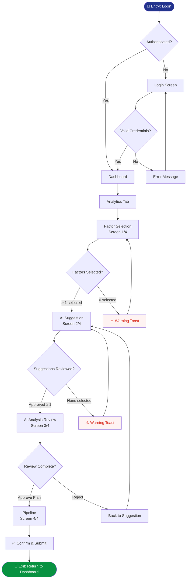

# User Flow Generator

สร้าง user flow diagram จาก brief หรือ prototype — ป้องกัน missing screens ก่อนเริ่มออกแบบ

## Usage
```
/user-flow [project-name]                       ← สร้างจาก brief + research
/user-flow [project-name] --from-prototype      ← reverse-engineer จาก index.html
/user-flow [project-name] --persona [role]      ← flow เฉพาะ persona
/user-flow [project-name] --feature [feature]   ← flow เฉพาะ feature
```

---

## Workflow

### STEP 1 — Gather Inputs

อ่านไฟล์ตามลำดับ:
1. `02-research/ux-research-doc-[name].md` — personas, goals, pain points
2. `02-research/ux-idea-card-[name].md` — design directions
3. `03-design/handoff-notes-[name].md` — screen list (ถ้ามี)
4. `05-prototype/index.html` — existing screens (ถ้าใช้ --from-prototype)

### STEP 2 — Identify User Types & Entry Points

สำหรับแต่ละ persona:
- **Entry point:** user เข้าระบบจากไหน
- **Primary goal:** ต้องการทำอะไร
- **Exit point:** จบที่ไหน
- **Frequency:** ใช้บ่อยแค่ไหน

### STEP 3 — Map Happy Path

เขียน main flow (ไม่มี error) ก่อน:
```
Login → Dashboard → [Feature] → [Sub-task] → Confirm → Success
```

### STEP 4 — Add Alternative Paths

- Empty state (ยังไม่มีข้อมูล)
- Error states (network fail, validation fail)
- Edge cases (permission denied, session expired)
- Branch conditions (if X → go to Y, else → go to Z)

### STEP 5 — Generate Mermaid Diagram

สร้าง diagram แบบ flowchart:



### STEP 6 — Screen Inventory

จาก flow สร้าง **screen list** ที่ครบถ้วน:

```markdown
## Screen Inventory

| # | Screen ID | Screen Name | Persona | Trigger | Next |
|---|-----------|-------------|---------|---------|------|
| 1 | screen-login | Login | All | App open | Dashboard |
| 2 | screen-dashboard | Dashboard | All | Login success | Any tab |
| 3 | screen-factor | Factor Selection | Analyst | Analytics tab | screen-suggestion |
| 4 | screen-suggestion | AI Suggestion | Analyst | Next from Factor | screen-analysis |
| 5 | screen-analysis | AI Analysis Review | Analyst | Next from Suggestion | screen-pipeline |
| 6 | screen-pipeline | Pipeline | Analyst | Approve Plan | screen-dashboard |

### Missing Screens (ยังไม่ได้ออกแบบ)
| # | Screen | เหตุผล |
|---|--------|--------|
| - | Error: Session Expired | ทุก protected screen ต้องการ |
| - | Empty: No Data Available | Analytics เมื่อยังไม่มี factor |
| - | Success: Pipeline Confirmed | หลัง Confirm |
```

### STEP 7 — Complexity Estimate

```markdown
## Project Estimate

| Category | Count |
|----------|-------|
| Happy path screens | N |
| Error/Edge case screens | N |
| Empty states | N |
| Modal/Overlays | N |
| **Total frames (Figma)** | **N** |
| **Total screens (Prototype)** | **N** |

Estimated effort: [S/M/L/XL]
Recommended approach: [single-file / module-based]
```

---

## Output Files
```
สร้าง: projects/[name]/02-research/user-flow-[name].md
  ├── Mermaid diagram (copy-paste เข้า mermaid.live)
  ├── Screen inventory table
  ├── Missing screens list
  └── Complexity estimate
```

## Tips
- รัน `/user-flow` ก่อนเริ่มออกแบบ — ป้องกัน missing screens ที่พบทีหลัง
- ใช้ `--from-prototype` เพื่อตรวจว่า prototype ครอบคลุม flow ครบไหม
- Mermaid diagram paste เข้า Notion, GitHub, หรือ mermaid.live ได้เลย
